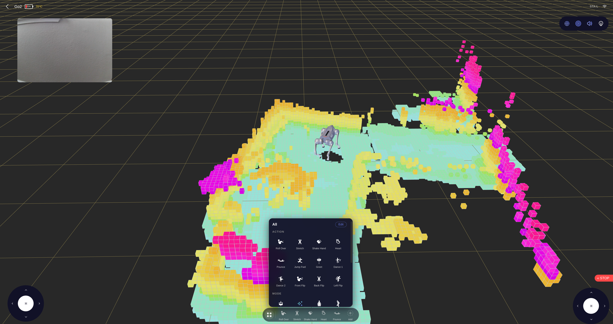
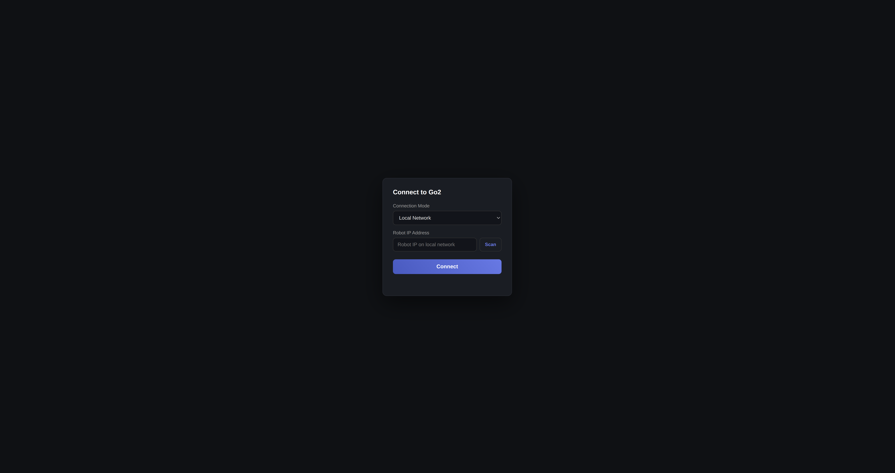
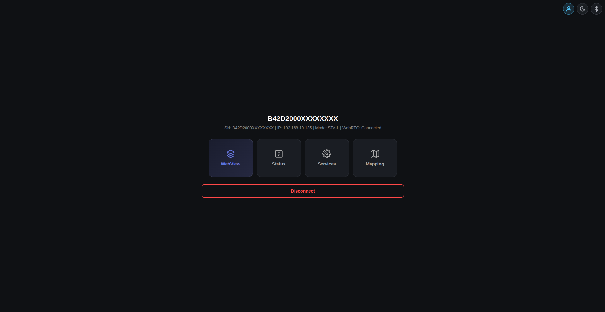
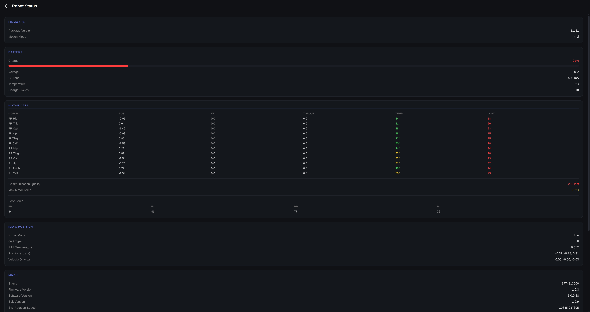
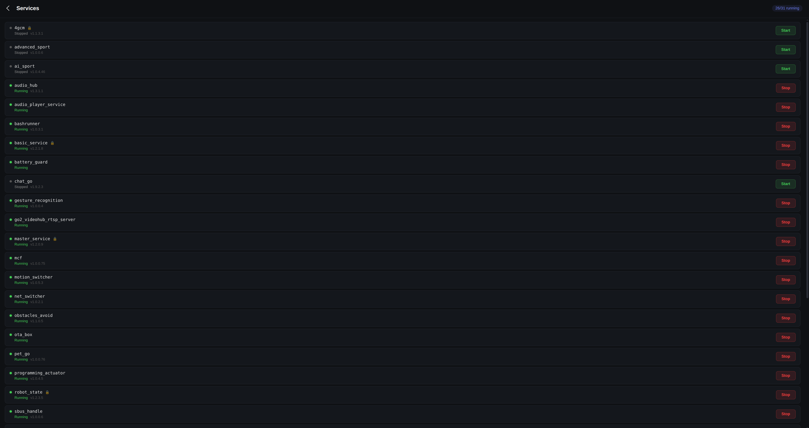

# Unitree Go2 WebRTC UI

A browser-based control interface for the Unitree Go2 robot dog, communicating over WebRTC. Built with TypeScript, Three.js, and Vite.




## Features

- **Real-time 3D visualization** — Go2 model with live joint angles, lidar spinning animation, and voxel point cloud (SLAM)
- **Camera feed** — Live video with PIP view swap (camera/voxel)
- **Dual joystick control** — Move and rotate the robot
- **Action bar** — Roll over, stretch, shake hand, dance, flips, and more (customizable carousel)
- **Mode switching** — Damping, free walk, sit, crouch, run, walk stair, hand stand, bound, cross step, etc.
- **Robot status** — Battery, motor data (temp, position, torque, lost packets), IMU, LiDAR state, network info
- **Service manager** — View all running services, start/stop with protection handling
- **Connection modes:**
  - **Local Network (STA-L)** — Direct connection via IP on same network
  - **Access Point (AP)** — Direct connection at 192.168.12.1
  - **Remote** — Cloud connection via Unitree account (email/password or token)
- **Network scanner** — UDP multicast auto-discovery of robots on the network
- **Firmware info** — Package version fetched via bashrunner

## Prerequisites

- Node.js >= 18
- npm >= 9
- Unitree Go2 robot (firmware v1.1.x+)

## Installation

```bash
git clone https://github.com/legion1581/unitree_go2_ui.git
cd unitree_go2_ui
npm install
```

## Usage

### Development

```bash
npm run dev
```

Starts the UI in local-only mode at http://localhost:5173.

For LAN visibility from other devices on your network, use:

```bash
npm run dev:host
```

Open the printed URL in **Chrome** (recommended).

The dev server includes:
- Hot module replacement
- Built-in UDP multicast scanner (no separate process needed)
- Proxy for robot API and Unitree cloud API (avoids CORS)

### Production Build

```bash
npm run build
npm run preview
```

## Connecting to the Robot

### Local Network (recommended)

1. Connect your computer to the same network as the Go2
2. Select **Local Network** mode
3. Click **Scan** to auto-discover the robot, or enter the IP manually
4. Click **Connect**

### Access Point

1. Connect to the Go2's WiFi hotspot
2. Select **Access Point** mode (IP is auto-filled to 192.168.12.1)
3. Click **Connect**

### Remote

1. Select **Remote** mode
2. Enter the robot's serial number
3. Either enter your Unitree account email/password, or paste an access token
4. Click **Connect**

| Connection | Hub | Status | Services |
|:---:|:---:|:---:|:---:|
|  |  |  |  |

## Browser Support

| Browser | Status |
|---------|--------|
| Chrome | Tested, fully working |
| Firefox | Experimental (WebRTC data channel timing differences) |
| Safari | Not tested |

## Project Structure

```
src/
  connection/       # WebRTC, local/remote connectors, network scanner
  crypto/           # AES-ECB, RSA, AES-GCM for auth and SDP exchange
  protocol/         # Data channel handler, topics, sport commands
  ui/
    components/     # Action bar, PIP camera, status/services pages, nav bar
    scene/          # Three.js scene, robot model, voxel map
  proxy-plugin.ts   # Vite plugin: robot proxy, scanner, cloud API proxy
public/
  icons/            # Action and mode SVG icons
  sprites/          # UI sprites and backgrounds
  models/           # Go2.glb 3D model
server/
  scanner.mjs       # Standalone UDP multicast scanner (optional)
```

## Sport Commands (API IDs)

Actions and modes use the MCF sport API IDs matching firmware v1.1.11:

| Action | ID | Mode | ID |
|--------|----|------|----|
| Roll Over | 1021 | Damping | 1001 |
| Stretch | 1017 | Free Walk | 2045 |
| Shake Hand | 1016 | Sit Down | 1009 |
| Heart | 1036 | Crouch | 1005 |
| Pounce | 1032 | Run | 1011 |
| Jump Forward | 1031 | Walk Stair | 1049 |
| Greet | 1029 | Lock On | 1004 |
| Dance 1 | 1022 | Static Walk | 1061 |
| Dance 2 | 1023 | Endurance | 1035 |
| Front Flip | 1030 | Leash | 2056 |
| Back Flip | 2043 | Hand Stand | 2044 |
| Left Flip | 2041 | Free Avoid | 2048 |
| | | Bound | 2046 |
| | | Jump | 2047 |
| | | Stand | 1006 |
| | | Cross Step | 2051 |

## License

MIT
