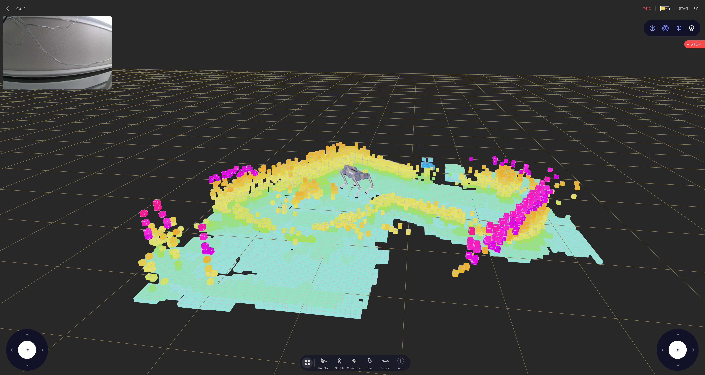
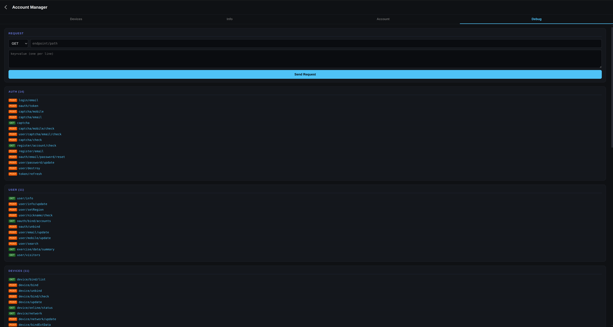
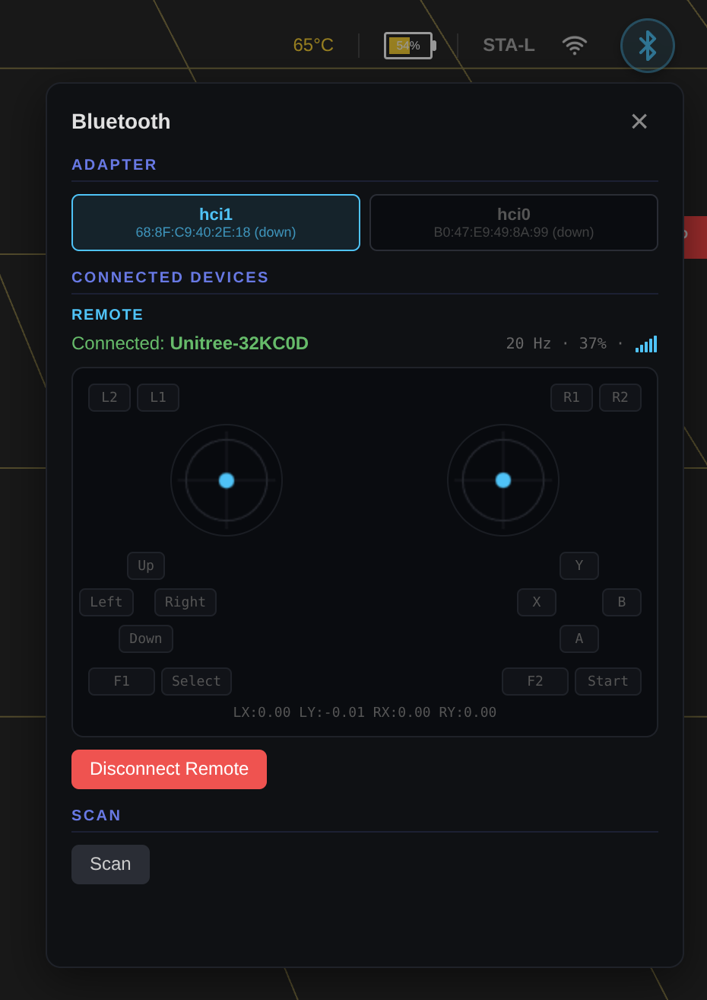
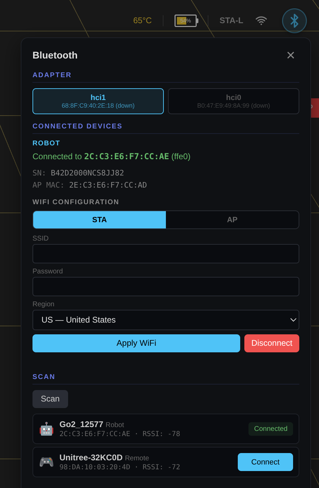
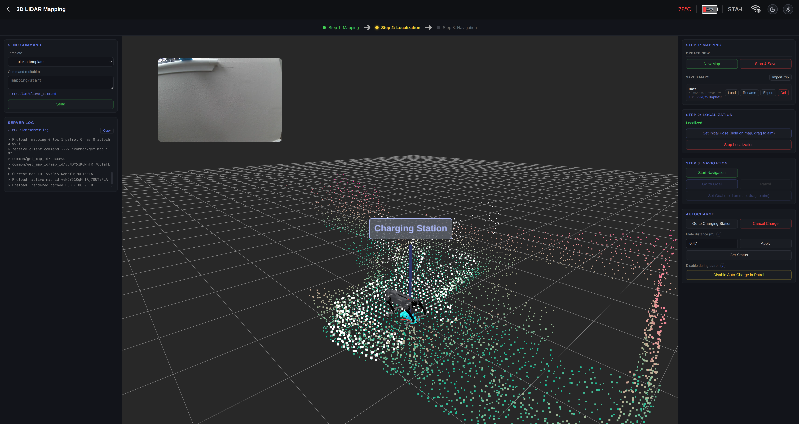

# Unitree Go2 WebRTC UI

A browser-based control interface for the Unitree Go2 robot dog, communicating over WebRTC. Built with TypeScript, Three.js, and Vite.




<p align="center">
  
  
  
  
</p>

<p align="center">
  
</p>

## Features

- **Real-time 3D visualization** — Go2 model with live joint angles, lidar spinning animation, and voxel point cloud (SLAM)
- **Camera feed** — Live video with PIP view swap (camera/voxel)
- **Dual joystick control** — Move and rotate the robot
- **Action bar** — Roll over, stretch, shake hand, dance, flips, and more (customizable carousel)
- **Mode switching** — Damping, free walk, sit, crouch, run, walk stair, hand stand, bound, cross step, etc.
- **Robot status** — Battery, motor data (temp, position, torque, lost packets), IMU, LiDAR state, network info
- **Service manager** — View all running services, start/stop with protection handling
- **Account Management** — Unitree cloud account: devices, firmware, tutorials, sharing, debug API console
- **3D LiDAR Mapping (SLAM)** — build maps, localize, navigate to goals, run patrol loops, auto-dock and charge; local IndexedDB cache + zip import/export so saved maps survive the robot's single-slot storage
- **Bluetooth Setup** — Configure robot WiFi over BLE (scan, connect, STA/AP mode) without the phone app
- **Remote Control** — Connect to the Unitree BLE remote, live joystick/button visualization with Hz counter
- **Dark / Light theme** — Floating sun/moon toggle in the top-right corner, persisted per-browser; scene background + grid adapt on the fly
- **Connection modes:**
  - **Local Network (STA-L)** — Direct connection via IP on same network
  - **Access Point (AP)** — Direct connection at 192.168.12.1
  - **Remote** — Cloud connection via Unitree account (email/password or token)
- **Network scanner** — UDP multicast auto-discovery of robots on the network
- **Firmware info** — Package version fetched via bashrunner

## Prerequisites

- Node.js >= 18
- npm >= 9
- Unitree Go2 robot (firmware v1.1.x+)

## Installation

```bash
git clone https://github.com/legion1581/unitree_go2_ui.git
cd unitree_go2_ui
npm install
```

## Usage

### Development

```bash
npm run start        # Starts Vite + BLE server together
npm run start:no-ble # Vite only (no Bluetooth features)
npm run dev          # Vite only (same as start:no-ble)
```

Open http://localhost:5173 in **Chrome** (recommended).

The dev server includes:
- Hot module replacement
- Built-in UDP multicast scanner (no separate process needed)
- Proxy for robot API, Unitree cloud API, and BLE server (avoids CORS)

### Production Build

```bash
npm run build
npm run preview
```

## Connecting to the Robot

### Local Network (recommended)

1. Connect your computer to the same network as the Go2
2. Select **Local Network** mode
3. Click **Scan** to auto-discover the robot, or enter the IP manually
4. Click **Connect**

### Access Point

1. Connect to the Go2's WiFi hotspot
2. Select **Access Point** mode (IP is auto-filled to 192.168.12.1)
3. Click **Connect**

### Remote

1. Select **Remote** mode
2. Enter your Unitree account email/password (or paste an access token)
3. Click **Login** — your robots load automatically
4. On the hub, click **WebRTC Connect** to establish the video/control stream
5. If your account has multiple robots, use the dropdown to pick one before connecting

## Bluetooth

Bluetooth configuration overlay available from any screen via the **BT icon** in the upper-right corner.

<p align="center">
  
  
</p>

- **Scan & connect** — discover and connect to Go2 robots and Unitree BLE remote controls
- **Adapter selection** — switch between multiple HCI adapters (useful with USB dongles)
- **Robot** — fetch serial number and AP MAC, configure WiFi (SSID, password, STA/AP mode, region)
- **Remote** — read live joystick axes and button states, relay them to the robot over WebRTC (`rt/wirelesscontroller`)

### Relay the BT Remote to the Robot

When a BLE remote control is connected, a gamepad icon appears in the control view's setting bar (alongside Radar, LiDAR, Volume, Light). Click it to forward the remote's joystick axes and buttons to the robot — the on-screen virtual joysticks hide while relay is active.

<p align="center">
  
</p>

Protocol reference:
- [docs/bluetooth-v1-v2.md](docs/bluetooth-v1-v2.md) — Go2 (all firmware) and G1 (`< 1.5.1`)
- [docs/bluetooth-v3.md](docs/bluetooth-v3.md) — G1 `≥ 1.5.1` extension (`VERSION` 0xF1, `GCM_KEY` 0xF2)

```bash
# Or run the BLE server separately:
pip install -r server/requirements.txt
npm run ble-server
```

## Account Management

Available in Remote mode via the hub. Provides access to the Unitree cloud API without needing the phone app.

- **Devices** — list robots with online status, details, firmware downloads, sharing, bind/unbind
- **Info** — app version with APK download, grouped video tutorials, changelog, announcements
- **Account** — profile, avatar, password, region, session management
- **Debug** — raw API console with 77 endpoints across 13 categories (Auth, Devices, Firmware, WebRTC, Wallet, etc.)

## 3D LiDAR Mapping

A full SLAM workflow in the browser, talking to the on-board `uslam_server` over WebRTC. Build a map, localize on it, drive to a goal, run a patrol loop, dock and charge — all without the phone app.



Key points:

- **Three-step flow** — `Mapping ➜ Localization ➜ Navigation`, gated by state and shown as a horizontal stepper banner under the header.
- **Mapping** — `mapping/start` / `stop`; live point cloud streams over `rt/uslam/frontend/cloud_world_ds`, decoded off-thread by `libslam.wasm` and rendered as voxels.
- **Localization** — drag a pose on the map, robot anchors and starts tracking; live scan + Go2 model both visible.
- **Go to Goal** — drag a goal pose, robot drives there; auto-issues `navigation/start` if needed.
- **Patrol** — multi-waypoint loop with full limit configuration: per-cycle time, total mission time, charge cycle time, loop count, BMS-SOC range. Reset to firmware defaults with one click.
- **Auto-charge** — dedicated section with plate-distance tuning and a one-click "Disable in Patrol" that kills all three NEED_CHARGE triggers.
- **Local map storage** — every saved map is cached in IndexedDB (PCD + PGM + TXT bundle); reloading uploads the bundle back to the robot via chunked `push_static_file` so localization/navigation work on saved maps even though the robot only has one physical slot.
- **Zip import / export** — share or back up maps. Each saved-map row has Export → `<name>.zip`; the section header has Import .zip.
- **Send Command panel** — left sidebar exposes a categorised template picker for ~56 SLAM commands, plus the live server log.
- **PiP video feed** — draggable camera preview overlaid on the 3D viewport.
- **Theme-aware** — dark and light themes apply to the 3D scene (background, grid, laser cloud) and the page chrome.

Full protocol reference, state machines, file paths, and known quirks live in [docs/slam.md](docs/slam.md).

## Browser Support

| Browser | Status |
|---------|--------|
| Chrome | Tested, fully working |
| Firefox | Experimental (WebRTC data channel timing differences) |
| Safari | Not tested |

## Project Structure

```
src/
  api/              # Unitree cloud API client (account, devices, firmware, etc.)
  connection/       # WebRTC, local/remote connectors, network scanner
  crypto/           # AES-ECB, RSA, AES-GCM for auth and SDP exchange
  protocol/         # Data channel handler, topics, sport commands
  ui/
    components/     # Action bar, PIP camera, status/services/account pages, nav bar
    scene/          # Three.js scene, robot model, voxel map
  proxy-plugin.ts   # Vite plugin: robot proxy, scanner, cloud API, BLE API proxy
public/
  icons/            # Action and mode SVG icons
  sprites/          # UI sprites and backgrounds
  models/           # Go2.glb 3D model
server/
  ble_server.py     # FastAPI BLE backend (scan, connect, WiFi config)
  scanner.mjs       # Standalone UDP multicast scanner (optional)
```

## Sport Commands (API IDs)

Actions and modes use the MCF sport API IDs matching firmware v1.1.11:

| Action | ID | Mode | ID |
|--------|----|------|----|
| Roll Over | 1021 | Free Walk | 2045 |
| Stretch | 1017 | Pose | 1028 |
| Shake Hand | 1016 | Run | 1011 |
| Heart | 1036 | Walk Stair | 1049 |
| Pounce | 1032 | Static Walk | 1061 |
| Jump Forward | 1031 | Endurance | 1035 |
| Greet | 1029 | Leash | 2056 |
| Dance 1 | 1022 | Hand Stand | 2044 |
| Dance 2 | 1023 | Free Avoid | 2048 |
| Front Flip | 1030 | Bound | 2046 |
| Back Flip | 2043 | Jump | 2047 |
| Left Flip | 2041 | Stand | 1006 |
| Damping | 1001 | Cross Step | 2051 |
| Sit Down | 1009 | Rear Stand | 2050 |
| Crouch | 1005 | Rage Mode | 2059 |
| Lock On | 1004 | | |

## License

MIT
