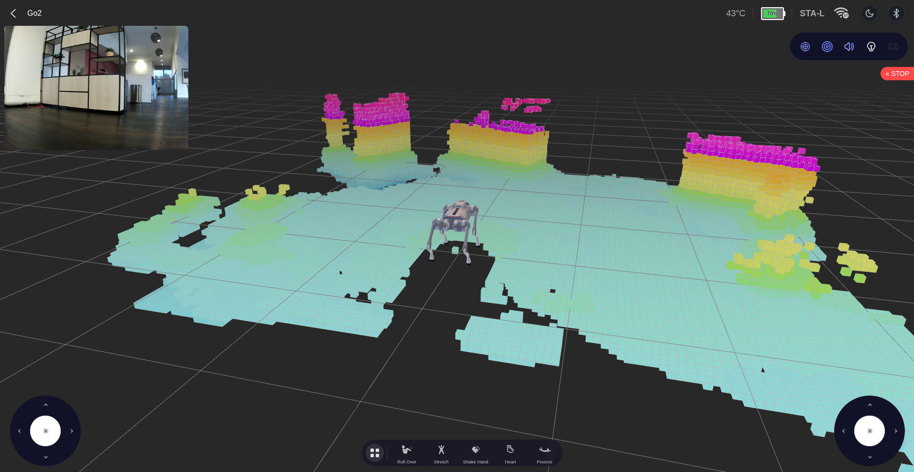
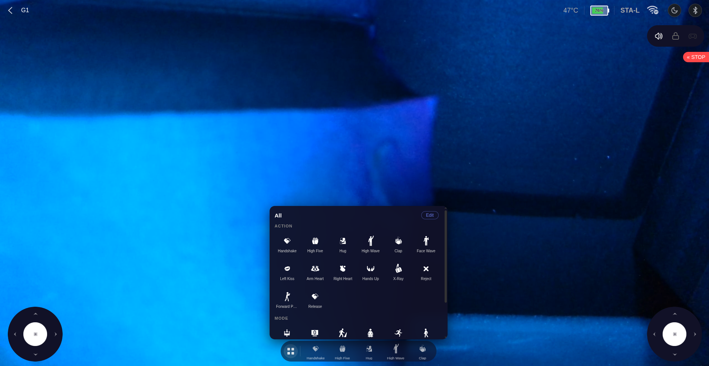
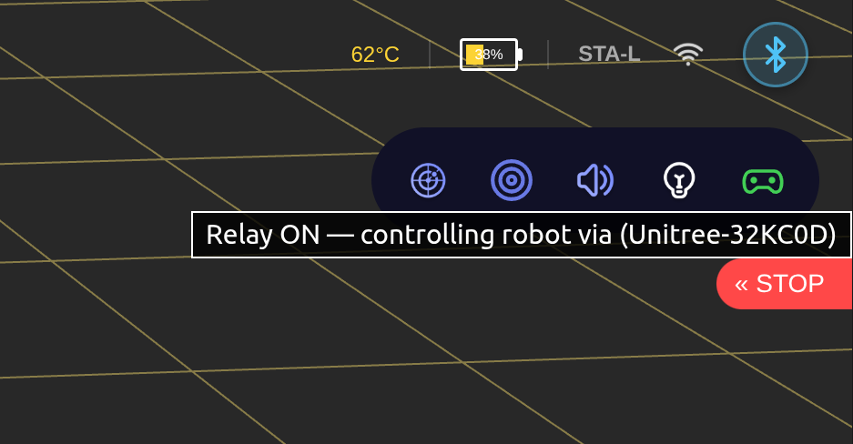

# Control View

The control view is the live operating screen — joystick + actions + camera + 3D scene.

  
  

## Layout

- **3D viewport** — Go2 / G1 model with live joint angles, lidar spinning animation, and SLAM voxel overlay (Go2).
- **Camera feed (PIP)** — draggable picture-in-picture; click to swap with the 3D scene.
- **Dual joysticks** — left moves, right rotates.
- **Action bar** — carousel of robot actions and modes. Customizable order.
- **Setting bar (top-right)** — Radar, LiDAR, Volume, Light. With a BLE remote connected, a gamepad icon also appears here for relay (see [bluetooth.md](bluetooth.md)).
- **Theme toggle** — floating sun/moon in the upper-right; preference is persisted.

## Actions and Modes

Actions and modes are issued as MCF sport API IDs. Tested against Go2 firmware v1.1.11; G1 uses an overlapping subset.

| Action | ID | Mode | ID |
|--------|----|------|----|
| Roll Over | 1021 | Free Walk | 2045 |
| Stretch | 1017 | Pose | 1028 |
| Shake Hand | 1016 | Run | 1011 |
| Heart | 1036 | Walk Stair | 1049 |
| Pounce | 1032 | Static Walk | 1061 |
| Jump Forward | 1031 | Endurance | 1035 |
| Greet | 1029 | Leash | 2056 |
| Dance 1 | 1022 | Hand Stand | 2044 |
| Dance 2 | 1023 | Free Avoid | 2048 |
| Front Flip | 1030 | Bound | 2046 |
| Back Flip | 2043 | Jump | 2047 |
| Left Flip | 2041 | Stand | 1006 |
| Damping | 1001 | Cross Step | 2051 |
| Sit Down | 1009 | Rear Stand | 2050 |
| Crouch | 1005 | Rage Mode | 2059 |
| Lock On | 1004 | | |

## BLE Remote Relay

When a Unitree BLE remote is paired (see [bluetooth.md](bluetooth.md)), a gamepad icon appears in the setting bar.

  

Click it to forward the remote's joystick axes and button states to the robot over `rt/wirelesscontroller`. The on-screen virtual joysticks hide while relay is active. Hz counter on the BT page shows the live update rate.

Protocol details: [remote-control.md](remote-control.md).
