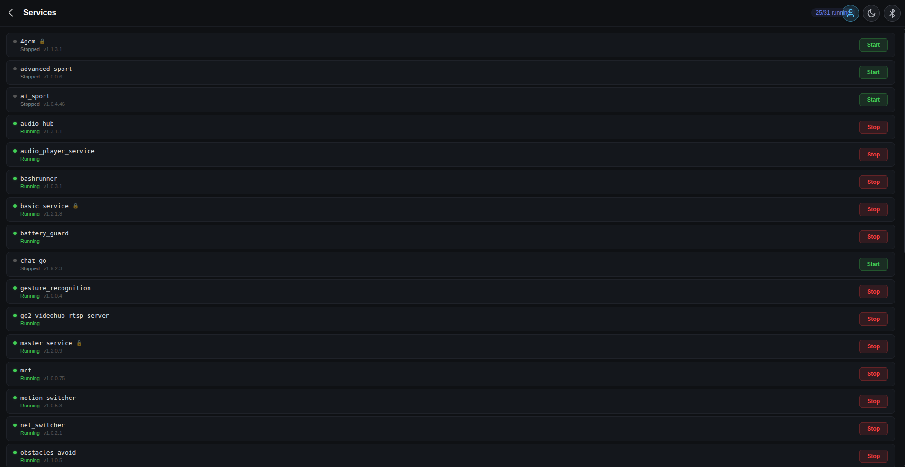
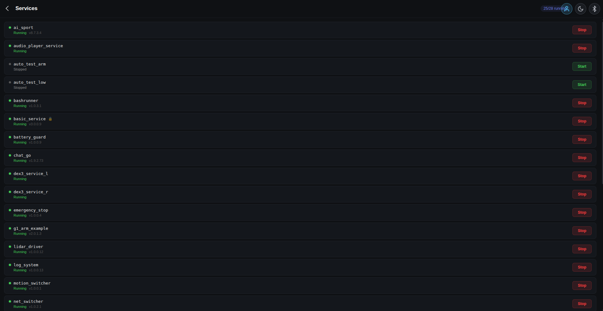

# Service Manager

View and control the on-board services running on the robot's MCF service bus. Useful for debugging, recovering from a hung service, or temporarily disabling something the firmware fights you over (obstacle avoidance, charge triggers, etc.).

  
  

## What it Shows

Each row is one MCF service:

- **Name** — service identifier as the robot publishes it.
- **Status** — running / stopped / protected.
- **Protect** — services flagged as "protected" by firmware will be auto-restarted if you stop them. The UI surfaces the flag so you don't get blindsided.
- **Actions** — Start / Stop buttons. Protected services will prompt before allowing stop.

## Family Differences

Go2 and G1 expose overlapping but not identical service trees. The UI subscribes to whichever topic the connected firmware advertises and renders the rows it gets back — there's no hardcoded service list per family.
