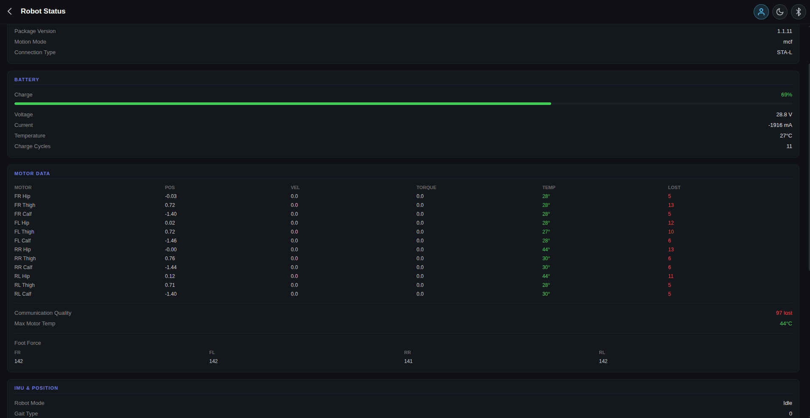
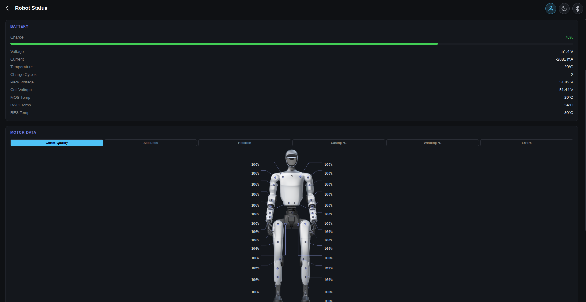

# Robot Status

Live diagnostics panel — battery, motors, IMU, system, network — with family-aware fields for Go2 and G1.

  
  

## Sections

### Battery

- **Go2** — pack voltage from `lowstate.power_v` (volts at the root, multiplied to mV in the UI), plus `bms_state.bq_ntc` / `mcu_ntc` for cell temperatures, SOC %, current, cycle count.
- **G1** — `bms_state.bmsvoltage` array: `[0]` is pack voltage, `[1]` is cell voltage. Plus per-rail temperatures: MOS, BAT1, RES.

### Motors

Per-joint table: temperature, position, velocity, torque, lost packets. Live-updates from `rt/lowstate`.

### IMU

Quaternion + RPY + gyroscope + accelerometer.

### LiDAR

Operational state, work mode, motor temp.

### System

Family-aware merge of firmware + system info:

- **Go2** — Package Version (single combined firmware string fetched via bashrunner).
- **G1** — Hardware Version + Software Version (separate fields, fetched from the device info API).

The **Connection Type** row (Local / AP / Remote, and which IP/SN) lives at the bottom of this section. The legacy "Network" card was folded in.

## Bashrunner Fetch (Go2)

Go2's package version isn't surfaced through any data-channel topic. The UI calls a small `bashrunner` RPC to read `/etc/unitree/version` (or equivalent), correlates the response by request ID where possible, and falls back to setting the firmware string on any matching reply — Go2 isn't always strict about echoing the ID back.

## Copy Buttons

Most labelled fields have a clipboard copy button next to the value (SN, IP, MAC, version strings). Click → green check; failure → red.
